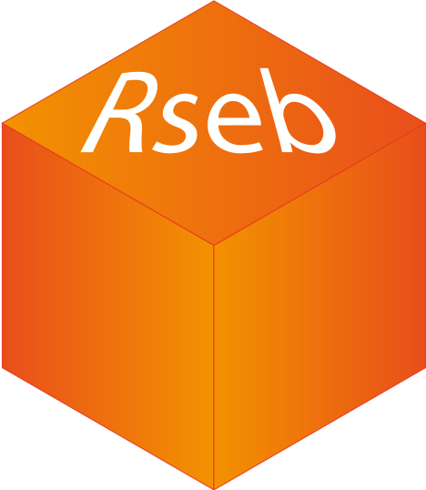

# Respositories

##  [Rseb](https://sebastian-gregoricchio.github.io/Rseb/)  
An R-package for daily tasks required to handle biological data as well as avoid re-coding of small functions for quick but necessary data management.

  
# Contact
For any information contact [sebastian.gregoricchio@gmail.com](mailto:sebastian.gregoricchio@gmail.com).

  
  

----------------------------------------------------------------------------------------------

